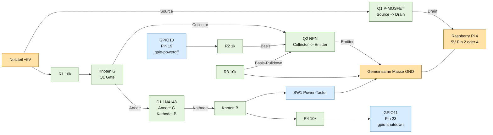

# Installation auf LibreELEC

## 1) Kodi Addon deployment

1. Ordner libreelec/addons/service.vcr.recorder nach /storage/.kodi/addons kopieren
2. Kodi neustarten
3. Addon in Services aktivieren

## 2) Runtime config

1. config/buttons.example.json -> buttons.json kopieren und anpassen
2. config/display.example.json -> display.json kopieren und anpassen
3. Dateien nach /storage/.kodi/userdata/addon_data/service.vcr.recorder/ legen
4. Fuer Direktbetrieb auf Raspberry Pi GPIO nutzen (source=gpio, pin=...)

Alternativ direkt die produktionsnahen Vorlagen verwenden:
1. config/deploy/buttons.json
2. config/deploy/display.json

## 3) Log debugging

1. Kodi log pruefen: /storage/.kodi/temp/kodi.log
2. Filter nach service.vcr.recorder

## 4) Direkte Tastenanbindung am Raspberry Pi

1. Taster jeweils zwischen GPIO und GND verschalten
2. BCM Pins in buttons.json setzen (Referenz: 17,27,22,23,24,25,26)
3. active_low=true und debounce_ms setzen
4. GPIO Backend in buttons.json:
	- backend=sysfs (empfohlen fuer minimales LibreELEC ohne gpioget)
	- backend=auto oder gpiod nur wenn gpioget vorhanden ist
5. Bei Problemen mit GPIO pruefen:
	- ohne gpioget direkt backend=sysfs nutzen
	- ob gpiochip0 der richtige Chip ist (ggf. gpiochip4)

## 5) SSD1309 Display (VFD Design)

1. Display-Konfig in display.json setzen:
	- bus=auto (empfohlen)
	- address=0x3C (alternativ 0x3D)
	- probe_mode=cmd (alternativ data oder none bei hartnaeckigem Errno 121)
	- invert/rotate180 bei Bedarf
   - Hinweis: Auf manchen Modulen steht 0x78/0x7A aufgedruckt (8-bit). Das entspricht 0x3C/0x3D (7-bit).
2. Addon rendert:
	- Titelzeile (scrollend)
	- Grossen Timecode (HH:MM:SS)
	- Status (PLAY/PAUSE/FF/RW/STOP)
	- L/R Aussteuerung
3. Bei leerem Display pruefen:
	- I2C aktiviert
	- auf LibreELEC zusaetzlich /flash/config.txt pruefen: dtparam=i2c_arm=on
	- im Kodi-Log auf "SSD1309 config" achten (zeigt gefundene /dev/i2c-* Devices)
	- dort pruefen, ob bus=1 gesetzt werden kann (falls auto nur HDMI-DDC Busse sieht)
	- richtige Adresse (0x3C/0x3D)
	- korrekte 3.3V/GND/SDA/SCL Verdrahtung

## 5b) Echte L/R Aussteuerung per HDMI Audio Extractor + ADS1115

Empfohlener Ansatz bei HDMI Passthrough:
1. HDMI Audio Extractor verwenden und analoges Stereo Signal (L/R) abgreifen.
2. Signal auf ADS1115 fuehren (mit passender Bias-/Schutzbeschaltung fuer 3.3V ADC).
3. In display.json setzen:
	- audio_source=ads1115
	- ads1115.bus=auto (oder 1)
	- ads1115.address=0x48
	- ads1115.channel_left=0
	- ads1115.channel_right=1
	- ads1115.gain=4.096
	- ads1115.sps=860
4. Optional feinjustieren:
	- ads1115.bias (Ruhewert, typ. 16384)
	- ads1115.full_scale_delta (Empfindlichkeit VU, typ. 4000..9000)

Hinweis:
- Dieser Weg ist unabhaengig von Kodi/Pulse/ALSA Routing und funktioniert auch bei direkter HDMI-Durchleitung.

## 5c) Software Audioanalyse (optional)

Kodi JSON-RPC liefert keine echten Live-PCM-L/R-Pegel. Fuer echtes VU-Meter wird ein externer Analyzer genutzt.

1. In display.json aktivieren:
	- audio_source=external (oder auto)
	- audio_levels_file=/dev/shm/service.vcr.recorder/audio_levels.json
2. Analyzer-Script auf dem Pi starten:
	- python3 /storage/.kodi/addons/service.vcr.recorder/tools/audio_level_writer.py --device auto
3. Der Analyzer schreibt laufend left/right (0..100) in audio_levels.json
4. Das Addon liest die Datei und zeigt echte L/R-Werte ohne Fake-Modulation

Hinweis zu SD-Kartenverschleiss:
- /dev/shm ist RAM (tmpfs). Das Schreiben der Pegeldatei erfolgt damit im Arbeitsspeicher statt auf SD.

Hinweis:
- Wenn arecord auf LibreELEC nicht verfuegbar ist, muss ein alternativer Audio-Capture-Pfad verwendet werden (z.B. externer Analyzer auf anderem Host oder eigener Binary-Helper).
- Der mitgelieferte audio_level_writer.py versucht automatisch: arecord, dann ffmpeg, dann parec.
- Bei parec wird bei --device auto bevorzugt eine .monitor-Quelle des Default-Sinks verwendet (wenn pactl verfuegbar ist).
- Wenn keines verfuegbar ist, bleibt der Service stabil und schreibt 0/0 mit Hinweistext in die JSON-Datei.
- Wenn nur auto_null als Sink existiert (pactl list short sinks zeigt nur auto_null), gibt es kein echtes Playback-Audiosignal fuer VU.
- In diesem Fall muss ein realer Sink/Source verfuegbar sein (z.B. ALSA/Pulse-Ausgabegeraet) oder ein externer Analyzer verwendet werden.

Wenn HDMI Audio direkt durchgeleitet wird (Passthrough) und keine nutzbare Capture-Quelle existiert:
- audio_source in display.json auf kodi setzen
- vcr-audio-levels.service deaktivieren (systemctl disable --now vcr-audio-levels.service)

Autostart via systemd (empfohlen):
1. Datei libreelec/config/system.d/vcr-audio-levels.service nach /storage/.config/system.d/ kopieren
   - sicherstellen, dass im Addon-Pfad vorhanden ist: /storage/.kodi/addons/service.vcr.recorder/tools/audio_level_writer.py
2. Service aktivieren und starten:
	- systemctl daemon-reload
	- systemctl enable vcr-audio-levels.service
	- systemctl start vcr-audio-levels.service
3. Status pruefen:
	- systemctl status vcr-audio-levels.service
4. Bei mehreren Pulse Devices den Monitor fest setzen (Beispiel):
	- --device alsa_output.1.hdmi-stereo.monitor

## 6) Zaparoo integration

1. PN532 USB v2 am Raspberry Pi einstecken
2. Die komplette RFID-/Medienlogik wird von Zaparoo ausserhalb dieses Repos verarbeitet
3. Keine RFID-Zuordnungsskripte im Addon noetig

## 7) Echtes Ein-/Ausschalten per Taster (Power-Latch-Schaltung)

Das Kodi-Addon ist dafuer nicht zustaendig, das laeuft komplett auf Firmware-/Kernel-Ebene. Ein GPIO-Pin allein kann
den Pi nicht wieder einschalten (waehrend er aus ist, laeuft kein Code) - dafuer wird ein P-MOSFET als Hauptschalter
mit einer kleinen Transistor-Latch-Schaltung verbaut. Der gleiche Taster startet den Pi (schliesst den MOSFET direkt)
und meldet spaeter per GPIO einen Shutdown-Wunsch, waehrend die Firmware/der Kernel den Latch offen haelt bzw. beim
Poweroff wieder aufloest.

### Bauteile

- Q1: P-Kanal MOSFET, Logic-Level (z.B. AO3401, IRLML6401), High-Side-Schalter zwischen Netzteil und Pi-5V-Eingang
- Q2: NPN-Kleinsignaltransistor (z.B. BC547, 2N3904)
- D1: Kleinsignaldiode (1N4148)
- R1: 10k (Source/Netzteil-Plus nach Gate, Pull-up)
- R2: 1k (GPIO10 nach Q2-Basis)
- R3: 10k (Q2-Basis nach GND, Bleeder)
- R4: 10k (Tasternode nach GPIO11, Schutzwiderstand)
- SW1: Taster (1x, 2 Pins)

### Verschaltung

### Uebersichtsschaltplan

```text
					Q1 P-MOSFET (High-Side)
Netzteil +5V o----------S
						 |\
						 | \ D------o------ Pi +5V (Pin 2 oder 4)
						 |  /
						 | /
						 |/
						 G
						 o Knoten G
						 |
			   R1 10k      +-------- C Q2 NPN
Netzteil +5V o---/\/\/----+           |
								   E
								   |
								  GND

GPIO10 (Pin 19) o---R2 1k---B Q2
								|
							R3 10k
								|
							   GND

Knoten G o---|<|---o Knoten B
		   D1     |
	  Anode an G   +--- SW1 Power-Taster --- GND
	  Kathode an B |
					 +--- R4 10k --- GPIO11 (Pin 23)

Pi GND, Netzteil GND und Schaltungs-GND gemeinsam verbinden.
```

### Grafischer Schaltplan



Im Diagramm zeigt der Pfeil an D1 die Anschlussreihenfolge **Knoten G -> Anode D1 -> Kathode D1 -> Knoten B**.

**D1-Orientierung:** Anode an Knoten G (MOSFET-Gate), Kathode an Knoten B (Taster/GPIO11).
Q1 ist ein P-Kanal-MOSFET; Source liegt am Netzteil-Plus, Drain am Pi-5V-Eingang. Niemals 5V direkt
an einen GPIO-Pin anschliessen. Vor dem ersten Einschalten Q1-Pinbelegung aus dem Datenblatt pruefen,
da sie je nach MOSFET-Gehaeuse unterschiedlich ist.

1. Q1 Source -> ankommendes 5V vom Netzteil
2. Q1 Drain -> Pi 5V-Eingang (Pin 2 oder 4), Netzteil-Plus wird NICHT mehr direkt an den Pi angeschlossen
3. Q1 Gate -> Knoten G:
	- ueber R1 (10k) an Netzteil-Plus (haelt Q1 im Ruhezustand gesperrt)
	- ueber D1 (Anode an G, Kathode an Knoten B) an den Taster-Knoten B
	- an Q2 Collector (Q2 Emitter an GND)
4. Taster SW1: ein Bein an GND, anderes Bein = Knoten B
	- Knoten B ueber D1 an Gate-Knoten G (siehe oben)
	- Knoten B ueber R4 (10k) an GPIO11 (Pin 23)
5. Q2 Basis ueber R2 (1k) an GPIO10 (Pin 19), zusaetzlich R3 (10k) Basis nach GND
6. Gemeinsames GND zwischen Netzteil, Pi und allen Bauteilen

Funktionsprinzip:
- Pi aus, Taster gedrueckt: Knoten B liegt auf GND, zieht ueber D1 das Gate (G) herunter -> Q1 leitet -> Pi bekommt Strom -> Pi bootet.
- Sehr frueh im Bootvorgang (noch vor dem Kernel) setzt die Firmware GPIO10 direkt auf HIGH -> Q2 schaltet durch -> haelt G dauerhaft auf GND, unabhaengig vom Taster (Latch). Der Taster kann losgelassen werden, der Pi bleibt an.
- D1 verhindert, dass der von Q2 gehaltene GND-Pegel an G auf Knoten B (und damit auf GPIO11) durchschlaegt: solange der Taster nicht gedrueckt ist, haelt der interne Pull-up von GPIO11 Knoten B auf ca. 3.3V (Ruhezustand = HIGH, wie bei den anderen Tastern im Projekt).
- Laufender Betrieb, Taster gedrueckt: GPIO11 geht auf LOW -> `gpio-shutdown` Overlay loest sauberes Shutdown aus.
- Am Ende des Shutdowns setzt das `gpio-poweroff` Overlay GPIO10 auf LOW -> Q2 sperrt -> G wird wieder von R1 auf Netzteil-Plus gezogen -> Q1 sperrt -> Pi wird stromlos.

### Konfiguration

1. Taster gemaess Schaltung verbauen (GPIO10 als Ausgang, GPIO11 als Eingang - beide NICHT in buttons.json eintragen, die Overlays beanspruchen die Pins exklusiv; GPIO19/GPIO21 bleiben fuer den I2S-Verstaerker aus Abschnitt 8 frei).
2. Per SSH auf den Pi einloggen und /flash beschreibbar machen: mount -o remount,rw /flash
3. In /flash/config.txt folgende Zeilen ergaenzen:
	- gpio=10=op,dh
	- dtoverlay=gpio-poweroff,gpiopin=10,active_low=1
	- dtoverlay=gpio-shutdown,gpio_pin=11,active_low=1,gpio_pull=up
4. /flash wieder read-only: mount -o remount,ro /flash
5. reboot (einmalig noch per Direktanschluss/altem Weg, damit die neuen Overlays geladen werden)

### Vergleich mit aresta/Rasp_latch_button

Die Referenzschaltung verwendet dieselben Kernel-Overlays, aber andere GPIOs:

| Funktion | Referenzprojekt | Diese Schaltung |
| --- | --- | --- |
| Shutdown-Taster | GPIO2 | GPIO11 |
| Poweroff/Latch-Hold | GPIO3 | GPIO10 |

Die GPIO-Zuordnung unserer Schaltung ist damit funktional korrekt. GPIO2/GPIO3 werden hier nicht verwendet,
weil GPIO2 und GPIO3 fuer den I2C-Bus des SSD1309 und ADS1115 benoetigt werden. Die GPIO-Nummern bestimmen
nicht die 5V-Leistung oder die Spannung am Raspberry Pi; ein Spannungseinbruch beim Loslassen muss deshalb
im MOSFET-/Netzteil-/Kabelpfad oder beim fehlenden Latch-Hold gesucht werden.

Zum isolierten Testen muss bei eingeschaltetem Pi gelten:

- GPIO10: HIGH (ca. 3,3 V), Q2 leitend, Q1-Gate nahe 0 V
- GPIO11: HIGH im Ruhezustand, LOW beim Tastendruck
- Pi-5V hinter Q1: stabil ca. 5,0 V, keinesfalls dauerhaft unter 4,75 V

Bleibt GPIO10 beim Loslassen LOW oder ist der Pi-5V-Pegel bereits bei gedruecktem Taster zu niedrig,
ist die Ursache nicht die GPIO-Auswahl. Dann Q2-Basisbeschaltung, Q2-Pinout, Q1-RDS(on), Netzteil,
Leitungsquerschnitt und die gemeinsame Masse pruefen.

Hinweise:
- `gpio=10=op,dh` setzt GPIO10 bereits durch die Firmware sofort auf HIGH, bevor der Kernel ueberhaupt startet - das
	verhindert einen kurzen Spannungseinbruch/Reset waehrend der fruehen Bootphase, bevor der Kernel das
	`gpio-poweroff` Overlay uebernimmt.
- Optional debounce=100 (ms) an die gpio-shutdown Zeile anhaengen, falls der Taster prellt.
- Kurzer Tastendruck im laufenden Betrieb = sauberes Shutdown + automatisches Abschalten der Stromversorgung.
- Kurzer Tastendruck im ausgeschalteten Zustand = Einschalten.

## 8) Sound-Effekte ueber MAX98357A (I2S)

Der MAX98357A ist ein I2S-Verstaerker (kein I2C). Die Effekte laufen als eigener `aplay`-Prozess im Hintergrund
auf der I2S-Soundkarte, nicht ueber den Kodi-Player; Kodi-Wiedergabe (HDMI) bleibt unberuehrt.

### Verdrahtung

| MAX98357A | Raspberry Pi |
| --- | --- |
| VIN | 5V (Pin 2 oder 4) |
| GND | GND |
| BCLK | GPIO18 (Pin 12) |
| LRC | GPIO19 (Pin 35) |
| DIN | GPIO21 (Pin 40) |
| SD, GAIN | offen lassen (Standard) |

**Pin-Belegung:** GPIO19 und GPIO21 sind fuer I2S fest vorgegeben. Der Power-Latch aus Abschnitt 7 liegt deshalb
auf GPIO10 und GPIO11 und kollidiert nicht mit dem Verstaerker.

### Einrichtung

1. In /flash/config.txt ergaenzen (Vorgehen laut Adafruit-Anleitung zum MAX98357A), danach reboot:
	- dtoverlay=hifiberry-dac
	- dtoverlay=i2s-mmap
2. Kartenname pruefen: `aplay -l` (erwartet z.B. sndrpihifiberry) und ggf. `device` in sounds.json anpassen.
3. config/deploy/sounds.json nach /storage/.kodi/userdata/addon_data/service.vcr.recorder/ kopieren.
4. WAV-Dateien nach /storage/.kodi/userdata/addon_data/service.vcr.recorder/sounds/ legen:
	- load.wav, eject.wav, stop.wav, play.wav (Dateinamen in sounds.json aenderbar)
5. Direkttest: `aplay -D plughw:CARD=sndrpihifiberry,DEV=0 /pfad/zur/datei.wav`

Ausloeser:
- LOAD und EJECT: bei jedem Tastendruck.
- STOP: nur wenn gerade etwas laeuft oder pausiert ist.
- PLAY: nur beim Fortsetzen aus der Pause (PLAY ohne aktiven Player tut nichts).
- Ein neuer Effekt ersetzt einen noch laufenden.
